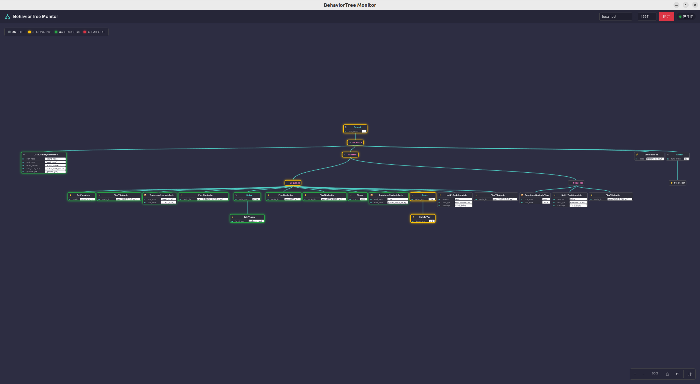

# BehaviorTree Monitor

基于 [BehaviorTree.CPP](https://github.com/BehaviorTree/BehaviorTree.CPP) Groot2 协议的行为树实时监控工具，能展示20个以上的节点状态(包括subtree内部节点)。

## 项目架构

```
Python (PySide6 + aiohttp)          Vue 3 + TypeScript
┌─────────────────────┐           ┌──────────────────┐
│  Qt WebEngineView   │──HTTP──►  │  前端 (dist/)     │
│  aiohttp Server     │◄─WS───►   │  WebSocket 客户端 │
│  ZMQ Bridge         │◄─ZMQ──►   │                  │
└─────────────────────┘           └──────────────────┘
                                        ▲
                                        │ ZMQ REQ/REP
                                        ▼
                                  BT.CPP 执行器
                                  (Groot2Publisher)
```

## 项目预览




## 项目结构

```
BehaviorTreeMonitor/
├── main.py                 # 入口
├── bt_monitor/
│   ├── protocol.py         # BT.CPP Groot2 协议
│   ├── server.py           # aiohttp WebSocket/ZMQ 桥接
│   └── app.py              # Qt WebEngine 窗口
├── frontend/               # Vue 3 + TypeScript
│   ├── src/
│   │   ├── App.vue
│   │   ├── components/
│   │   ├── composables/
│   │   ├── stores/
│   │   ├── types/
│   │   └── styles/
│   └── ...
└── bt_monitor.spec         # PyInstaller 配置
```

## 开发

### 环境配置

- [uv](https://docs.astral.sh/uv/) (Python 包管理)
- Node.js 18+ & pnpm

### 安装依赖

```bash
# Python 依赖
uv sync

# 前端依赖
cd frontend && pnpm install
```

### 开发运行

- 构建前端

```bash
cd frontend
pnpm build
```

- 启动应用

```bash
uv run python main.py
```

### 构建发布

```bash
# 1. 构建前端
cd frontend && pnpm install && pnpm build

# 2. PyInstaller 打包
uv run --group dev pyinstaller --clean --noconfirm bt_monitor.spec
```

输出文件: `dist/BehaviorTreeMonitor`

## 下载运行

如果不想自己构建，可以直接在[release页面](https://github.com/riyuexingchennnn/BehaviorTreeMonitor/releases)下载编译的版本。

注意：ubuntu系统要首先chmod赋予执行权限再点击运行。

